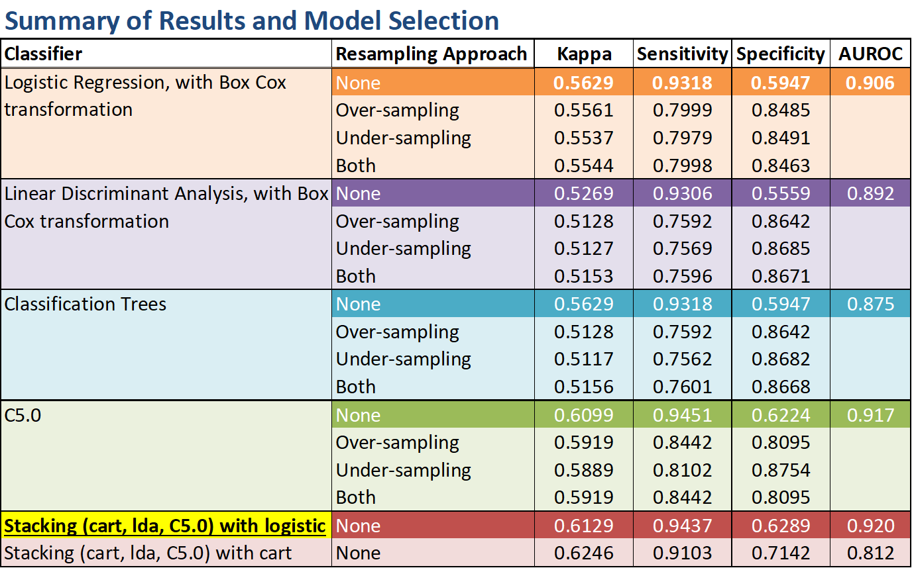

# Prediction of Low Income Levels 

## From 1994 United States Census Data    
##### Team members: Traci Lim, Yi Luo, Bill Skinner
---
This markdown document is a summary of a fairly well-documented 10-page report of the entire machine learning process, which includes a detailed study of 5 different machine learning algorithms, justifying their impact and comparing their performance. 

The code used is based on the programming language R.

### Background and aims

Governments interested in engaging in affirmative action to benefit lower income populations may find it useful to have a model that predicts whether people with certain characteristics would have earned less than 50 thousand dollars per year in 1994. This model would enable them to input the same characteristics for people today to see whether the income level they would likely have had in 1994 would have been less than 50 thousand dollars per year which could be used to evaluate and substantiate any findings on social welfare, say, improvement in living conditions or individual growth in paygrade. The aim of this project is to provide such a model that predicts whether income in the United States is less than fifty thousand dollars per year.    

---

### Methodology 

We first used univariate and multivariate analysis to examine the dataset, revealing the class imbalance problem. Then, to prepare the data for model building, we created four separate data sets to evaluate the effectiveness of three different resampling approaches to solve the class imbalance problem. To reach the best predicting power, we experimented with several learning methods, and we also normalized numerical variables when appropriate for the method. Considering both the success metrics and running time, we narrowed down to 5 main methods: 

- Logistic Regression
- Linear Discriminant Analysis (LDA)
- Classification and Regression Trees (CART)
- Tree Boosting (C5.0)
- Stacking

The predicting ability of our model has the potential application to improve the efficiency of a social welfare system where the government needs to allocate subsidies to those in the greatest need.    

---

### Summary and Interpretation of Results 

The following table shows a list of the well-performing classifiers we evaluated with the best model in each method, or local optimal model, highlighted with a darker colour hue. All running times are for when the code was run on an Intel(R) Core(TM) i7-7700HQ Lenovo laptop, with 16GB of RAM.    

Models trained on non-resampled training sets have generally poor specificity scores because standard classification models (e.g. logistic regression, SVM, decision trees, nearest neighbors) treat all classes as equally important and thus tend to be biased towards the major class in imbalanced problems, producing a high sensitivity score (E. Burnaev, P. Erofeev, & A. Papanov, 2017). 

Models trained on resampled training sets produced a lower Kappa statistic and sensitivity, despite boosting specificity favourably, as compared to models trained on non-resampling training sets. Although resampling approaches have improved the prediction of the minority class, it comes with an undesirable trade-off in a drop in Kappa and sensitivity. This could be due to the nature of random resampling approaches. For over-sampling, the replication of minority class samples likely led to overfitting. Likewise, for under-sampling, the sample chosen may be biased, resulting in inaccurate results.  

Logistic regression (LR) outperforms linear discriminant analysis (LDA) significantly, in terms of the Kappa statistic. This could be because LR, unlike LDA, is relatively robust, and it does not require assumptions to be made regarding the distribution of the features, whereas LDA assumes features are normally distributed. Since not all of the features are normally distributed, the usage of LDA is theoretically wrong, as the assumptions are not completely met, despite applying a Box-cox transformation (Pohar, Blas, & Turk, 2004). Tree-based classifier rpart displays higher scores compared to LR and LDA because of its flexibility in handling categorical features, and requires minimal assumptions. The top contender for the best model is a tree-based boosting version of C5.0. Other than being able to detect the relevancy of features, it handles the multi-value features well and mitigates the over fitting problem by automated pruning. Our final tuned C5.0 a tree-based C5.0 method is accompanied with 15-trial boosting, where 15 separate decision trees or rulesets are combined to make predictions. Figure 16 in Appendix A lists the top 13 features it uses to classify samples from the training set. We picked the best model by examining 3 main metrics: Kappa statistic, sensitivity, and Area under ROC curve. The best performing model is the stacked model: rpart, LDA, and C5.0 (highlighted in yellow). We combined the predictions of these three individually-tuned models using logistic regression. Its outstanding scores can be credited to its smoothing nature and ability to highlight each base model where it performs best and discredit each base model where it performs poorly (Gorman, 2016).

---

### Conclusion and takeaways

We obtained our best model through the use of the technique of Stacking, in which we combined three models (LDA, CART, and C5.0), attaining a sensitivity of 94.37%. This result means that given the set of feature values (age, education level, etc.) our model would correctly classify about 94% of people who make less than fifty thousand dollars per year, although it would only correctly classify about 63% of people who make more than that. 

For a welfare system that should benefit those in greatest need, even at the expense of “wasting” some subsidies on the less deprived, our model could be an effective tool for predicting which people have lower income based only on a set of survey characteristics. 

There are some notable takeaways from this project. Having models trained on different resampling methods taught us that resampling a class imbalance dataset might not deliver results compatible with preliminary objectives. Although there is likely no algorithm that performs consistently well every time, understanding the strengths and weakness of each method still gives one an edge over randomly fitting a myriad of models and hoping for the best. Overall, we are pleased with our approach in optimizing predictive performance. Many other algorithms were attempted, but they were computationally slow to train and tune. Given excess time, we may look into implementing parallel processing in R to speed up some of the computationally expensive tasks, like tuning Support Vector Machines and Random Forest models. We could also perform a deeper analysis to justify the grouping of levels in categorical features, because the grouping was done intuitively without thorough justification.    

 